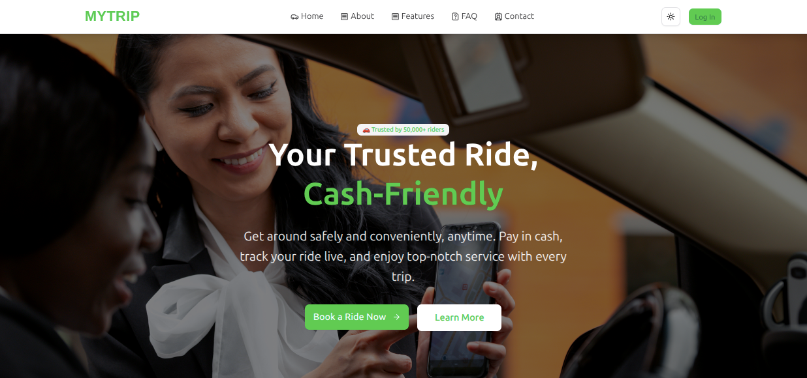

# MyTrip - Ride Sharing Platform (Frontend)



**mytrip** is a modern, full-stack, role-based ride booking platform designed to provide a seamless and secure experience for riders, drivers, and administrators. Built with a production-grade technology stack, this application demonstrates complex state management, real-time communication, and a robust, scalable architecture.

**Live Frontend URL:** [**https://mytrip-ride-share.vercel.app/**](https://mytrip-ride-share.vercel.app/)<br>
**Live Backend URL:** [**https://my-trip-ride-sharing-backend.vercel.app/**](https://my-trip-ride-sharing-backend.vercel.app/)

---

---

## 🔑 Test Credentials

| Role       | Email                    | Password    |
| :--------- | :----------------------- | :---------- |
| **Admin**  | `admin@gmail.com`        | `Pa$$w0rd!` |
| **Driver** | `rubel.driver@gmail.com` | `Pa$$w0rd!` |
| **Rider**  | `rana@rider.com`         | `Pa$$w0rd!` |

---

## ✨ Core Features

### 👨‍💼 Admin Features

- **Analytics Dashboard:** Visualizes key platform metrics like total revenue, ride volume, and user statistics with dynamic charts.
- **User Management:** A comprehensive interface to search, filter, and manage all riders and drivers. Admins can `block/unblock` riders and `approve/suspend` drivers.
- **Ride Oversight:** A complete log of all rides on the platform with advanced filtering and sorting capabilities (by date, fare range, status, etc.).

### 🚗 Driver Features

- **Availability Control:** A real-time toggle to switch between `Online` and `Offline` status, with optimistic UI updates.
- **Incoming Requests:** A paginated and filterable "marketplace" view of available ride requests. Drivers can `accept` or `dismiss` requests.
- **Active Ride Management:** A dedicated, map-based interface to manage ongoing trips with clear, step-by-step actions (`Confirm Pickup`, `Start Trip`, `Complete Ride`).
- **Earnings Dashboard:** A personal analytics page showing total earnings, completed trips, and daily income trends via interactive charts.
- **Ride History:** A detailed, paginated log of all past rides.

### 🧍 Rider Features

- **Dynamic Ride Request:** An interactive map-based form to select pickup and destination, with real-time fare estimation.
- **Active Ride View:** A page to view the current ride status and driver details, with real-time status updates pushed from the server via WebSockets.
- **Ride History:** A paginated and sortable list of all previous trips.
- **Profile Management:** All users can update their personal information and change their passwords.

### 🛡️ General & Safety Features

- **Role-Based Access Control (RBAC):** Secure dashboards and routes tailored to the logged-in user's role (Admin, Driver, or Rider).
- **Real-time Notifications:** Riders receive instant notifications (via Socket.IO) when their ride status is updated (e.g., completed or cancelled).
- **Robust Error Handling:** Professional handling of validation, authorization, and network errors with user-friendly toast notifications.

---

## 🛠️ Technology Stack

| Category             | Technology                                   |
| :------------------- | :------------------------------------------- |
| **Frontend**         | React, TypeScript, React Router, Vite        |
| **State Management** | Redux Toolkit, RTK Query                     |
| **Styling**          | Tailwind CSS, shadcn/ui                      |
| **Mapping**          | React Leaflet, OpenStreetMap, OSRM (Routing) |
| **UI/UX**            | react-hot-toast, recharts (Charts)           |
| **Backend**          | Node.js, Express.js, TypeScript, Mongoose    |
| **Database**         | MongoDB                                      |
| **Authentication**   | JWT, Passport.js, bcrypt                     |
| **Deployment**       | **Frontend:** Vercel, **Backend:** vercel    |

---

## 🚀 How to Run Locally

1.  **Clone the repository:**
    ```bash
    git clone [https://github.com/rubelrana123/MT-Ride-Sharing-Client](https://github.com/rubelrana123/MT-Ride-Sharing-Client)
    cd MT-Ride-Sharing-Client
    ```
2.  **Install dependencies:**
    ```bash
    bun install
    ```
3.  **Set up environment variables:**
    Create a `.env` file in the root and add the following:
    ```
    VITE_API_BASE_URL=http://localhost:3000/api/v1
    ```
4.  **Run the development server:**
    ```bash
    npm run dev
    ```

The application will be available at `http://localhost:5173`.

<br>
<br>

## 🧑‍💻 Author

##### Rubel Rana

Frontend Dev | Backend Learner | MERN Stack Enthusiast
<br>
GitHub: @rubelrana123<br>Linkedin: @rubelrana123
